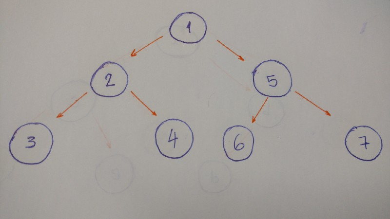

# Trees

A tree is a collection of entities called nodes. Nodes are connected by edges. Each node contains a value or data, and it may or may not have a child node . 

* The first node of the tree is called the root. If this root node is connected by another node, the root is then a parent node and the connected node is a child.

* All Tree nodes are connected by links called edges.

* Leaves are the last nodes on a tree. They are nodes without children. Like real trees, we have the root, branches, and finally the leaves. 

* The height of a tree is the length of the longest path to a leaf.

* The depth of a node is the length of the path to its root.

 

### Terminology 

Root is the topmost node of the tree

Edge is the link between two nodes

Child is a node that has a parent node

Parent is a node that has an edge to a child node

Leaf is a node that does not have a child node in the tree

Height is the length of the longest path to a leaf

Depth is the length of the path to its root

### Binary trees

a binary tree is a tree data structure in which each node has at the most two children, which are referred to as the left child and the right child

* binary tree is that it is a collection of nodes. Each node has three attributes: value, left_child, and right_child.

            class BinaryTree:
            constructor(self, value):
                    self.value = value
                    self.left_child = None
                    self.right_child = None

 * we pass the value (the data of the node) as a parameter. the left_child and the right_child. Both are set to None. (we create our node, it doesn’t have any children. We just have the node data.)

 * will implement a method to insert a new node to the right and to the left.
 * If the current node doesn’t have a left child, we just create a new nodeand set it to the current node’s left_child.

* If it does have the left child, we create a new node and put it in the current left child’s place. Allocate this left child node to the new node’s left child.

        function insert_left(self, value):
            if self.left_child == None:
                self.left_child = BinaryTree(value)
            else:
                new_node = BinaryTree(value)
                new_node.left_child = self.left_child
                self.left_child = new_node

* we do the same thing to insert a right child node.     

            function insert_right(self, value):
                if self.right_child == None:
                    self.right_child = BinaryTree(value)
                else:
                    new_node = BinaryTree(value)
                    new_node.right_child = self.right_child
                    self.right_child = new_node

### tree traversal

* two options here: Depth-First Search (DFS) and Breadth-First Search (BFS).

DFS “is an algorithm for traversing or searching tree data structure. One starts at the root and explores as far as possible along each branch before backtracking.

DFS explores a path all the way to a leaf before backtracking and exploring another path.

1. Start at the root (1). Print it.
2. Go to the left child (2). Print it.
3. Then go to the left child (3). Print it. (This node doesn’t have any children)
4. Backtrack and go the right child (4). Print it. (This node doesn’t have any children)
5. Backtrack to the root node and go to the right child (5). Print it.
6. Go to the left child (6). Print it. (This node doesn’t have any children)
7. Backtrack and go to the right child (7). Print it. (This node doesn’t have any children)

In-order  3–2–4–1–6–5–7.

1. Go to the left child and print it. This is if, and only if, it has a left child.
2. Print the node’s value
3. Go to the right child and print it. This is if, and only if, it has a right child.

 

Post-order  3–4–2–6–7–5–1.

1. Go to the left child and print it. This is if, and only if, it has a left child.
2. Go to the right child and print it. This is if, and only if, it has a right child.
3. Print the node’s value
 
